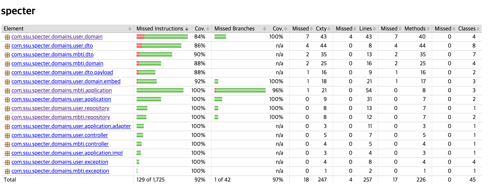

# 스펙터 과제 API

## 프로젝트 설명

### 코드 컨벤션
- `별도 요구되는 컨벤션이 없어서 개인적인 컨벤션을 적용 했습니다.`
	- 변수 및 메서드 네이밍 : 풀네임 (단축어 사용 X)
	- DB 컬럼 물리명 : 자체 보유 용어사전 기준 물리명(단축어)

### 구현 방향 설명 
- `BaseRepository`
	- JPA + Querydsl 통합 레파지토리
	- 도입 이유
		- 일반적으로 복잡한 조인이 필요하거나 Where clause 가 많아질 경우 JPA 메서드명 가독성이 매우 나빠집니다.
		- 그에 따라 Querydsl 을 도입하였지만, 기본 사용법 기준으로 Custom Interface 및 구현 클래스가 추가되어 엔티티 별 총 3개의 클래스가 만들어 집니다.
		- 개발 생산성 향상을 위해 JpaRepository 와 Querydsl 을 통합하여 하나의 레파지토리로 관리되도록 설계했습니다.
		- 기본적으로 'CUD' 는 JPA 가 담당하도록 하고, 'R' 은 Querydsl 메서드를 만듭니다.

- `record 객체`
	- User, MbtiQuestion, MbtiAnswer 도메인의 DTO 는 record 로 설계했습니다.
	- 다만, 객체 생성 편의를 위해 Lombok 의 @Builder 를 함께 사용합니다.

- `Master/Slave 구조의 DataSource`
	- 요구사항에 정의 되진 않았지만, 성능을 위해 Master(Read/Write), Slave(ReadOnly) 구조의 Datasource 를 설계했습니다.
	- 메서드에 `@Transactional(readOnly = false)` 선언되면 Master Datasource 로 라우팅 됩니다.
	- 다만, 본 프로젝트에 적용 된 Embedded H2 Database 는 Slave Replica 기능이 없으므로 엔드포인트는 동일하게 설정했습니다.

### 테스트 결과 (주요 도메인 로직 대상 코드 커버리지 92% 달성)

## Swagger
http://localhost:8080/spctr/swagger.html

## H2 Database Console
http://localhost:8080/h2-console